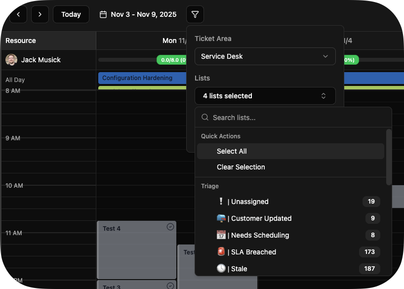
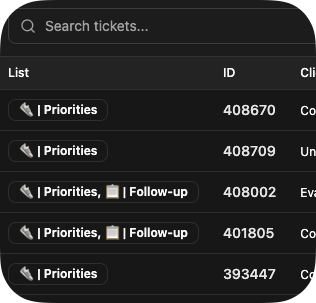
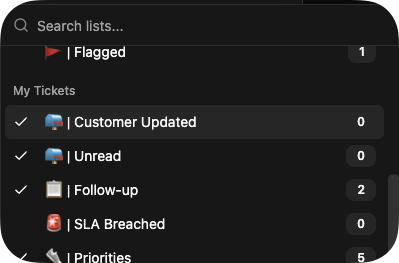
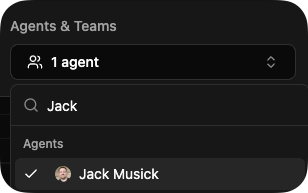
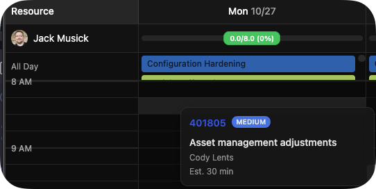
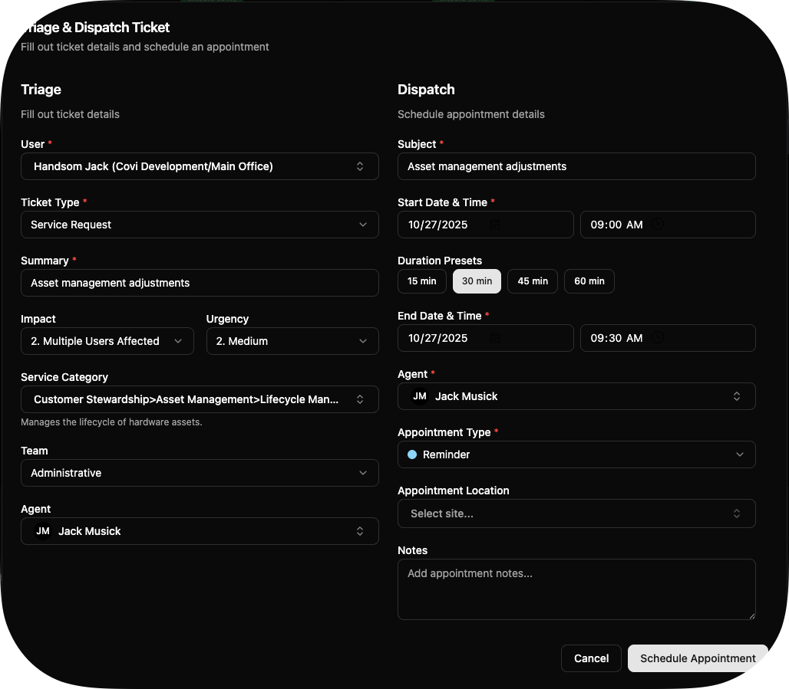
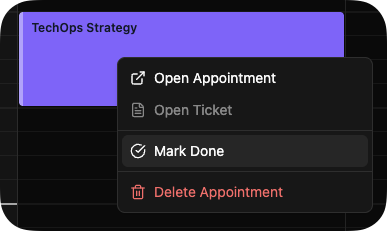
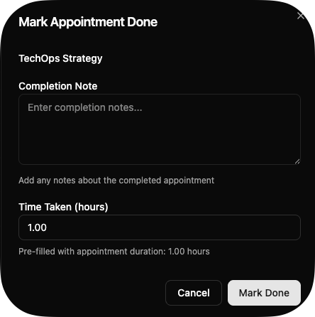

# Overview

Halo Dispatch Portal is a client-only web application that creates a better dispatching view for HaloPSA, informed by Sea-Level (now Pax8) best practices many of us learned when maturing our MSPs. Unfortunately, those best practices don't translate well into HaloPSA, so the goal with this project is to use Halo-native features to recreate this experience.

# Setup

## 1. Create Halo Application

Note: If you're self-hosting, only the URLs will change.

1. Go to **Config > Integrations > Halo API** in your Halo instance
2. Click **View Applications** → **New**
3. Configure:
    - **Name**: Halo Dispatch Portal
    - **Auth Method**: Authorization Code (Native Application)
    - **Redirect URI**: `https://halodispatchportal.gobifrost.com/auth/callback`
    - **Permissions**: `all:standard`
    - **Grant Types**: Authorization Code
    - **CORS Whitelist**: `https://halodispatchportal.gobifrost.com`

## 2. Configure App

1. Start Halo Dispatch Portal
2. Click **Configure** and enter:
    - **Tenant**: Your subdomain (e.g., `mymsp` for `mymsp.halopsa.com`)
    - **Auth Server**: Your Authorization Server URL (from Config > Integrations > Halo API)
    - **Resource Server**: Your Resource Server URL (from Config > Integrations > Halo API)
    - **Client ID**: From your Halo application details

## 3. Connect

1. Click **Connect to Halo**
2. Authorize in Halo
3. Start dispatching!

# Usage

## Configuration

Areas, Lists, Teams and Agents are in the "Filters" flyout menu at the top. Instead of having to flip between views, we flatten the ticket list and group the lists in the first column. Since Halo's lists lack features like AND, OR and grouping operators, this approach lets you create multiple lists like "Unread", "New", and "Needs Scheduling" that all display together.

This presents itself like this in the list of tickets:

The goal is to create lists that represent all the things that need action and manage them to zero in one view. Unlike some other PSAs, a side benefit here is the "List" column tells you _why_ something is there, which helps you figure out how to remove it.

This isn't just for dispatchers. One of the goals was to let technicians work out of their calendar without the usual headache. If you're like me and have setup your lists creatively, you might have a "My Tickets" group. A technician would just filter to their list (which likely already exists) and their agent.

## Dispatch Priority Score

The ticket list's Priority column shows a client-side dispatch score (0-100, higher = needs attention sooner) next to the Halo priority chip; hover the badge for the breakdown and click the column header to sort by score. The score is SLA (0-40: overdue 40, warning 25, ok 10, on-hold/excluded/no fix-by date 0, via the shared `computeSla` helper) + age (0-25, log scale on the reported date, saturating at 7 days) + staleness (0-20, linear on hours since last action, saturating at 48h) + a priority boost (0-15 from `priority_id`). Weights and saturation points live in the exported `PRIORITY_SCORE_WEIGHTS` constant and the id-to-boost mapping in `DEFAULT_PRIORITY_BOOST_MAP`, both in `src/lib/priority-score.ts` — tune them per tenant if Halo priority ids differ. No extra API calls are made; scoring runs entirely in the browser from already-loaded ticket fields.

## Scheduling

You can drag and drop tickets from the list onto the calendar.

On drop (or ticket creation) you'll see a window like this:

The form includes what I felt were sensible defaults for most MSPs:

- Ticket Type
- Summary
- Impact and Urgency
- Category 1 (usually the Service Category)
- Team
- Agent

In the second column, we have a simplified appointment window to avoid extra steps.

Very little needs to be changed in most cases. The agent will be set to whoever's timeslot you dragged it to, existing defaults will stay, the appointment type will default to the first one and so forth.

## Completing Tickets

Straight from the calendar screen you can mark yourself as done.

This lets you put in a note and the time taken.

One of my biggest pet peeves in Halo is how tedious it is to mark appointments as complete with the flyout menu, scrolling, moving "Complete" button, etc. This stays simple so you can do what you need to do, no more no less.

# Current Limitations

A few things to note about the MVP:

1. **Fixed Columns** - The ticket list has hand-selected columns. I couldn't figure out how all ticket properties were translated into Display Names (despite some being in the language pack and custom fields being available), so I simplified this for the MVP.

2. **Simplified Ticket Fields** - Ticket creation and scheduling use a subset of available fields. I picked what I thought were sensible defaults that most instances should have. I didn't want to get into the rabbit hole of recreating Halo's dynamic visibility rules or parsing their field types to figure out things like dynamic lookups. I'm aware of the APIs to do this, but it felt too complex for an MVP.

# Development

- `npm run dev` — local dev server; `npm run build` / `npm run preview` — production bundle.
- `npm run lint` — eslint; `npm run format` / `npm run format:check` — prettier (also enforced on staged files via lint-staged).
- `npm run test` — vitest unit suite (auth expiry/PKCE, config validation, Halo response schemas, API client with MSW); `npm run test:coverage` for coverage.
- `npm run test:e2e` — Playwright smoke suite against `vite preview` using synthetic fixtures in `e2e/fixtures/` (run `npm run build` first). No live Halo tenant is touched.
- CI (`.github/workflows/ci.yml`) runs lint + build + unit tests, then the Playwright smoke suite.
